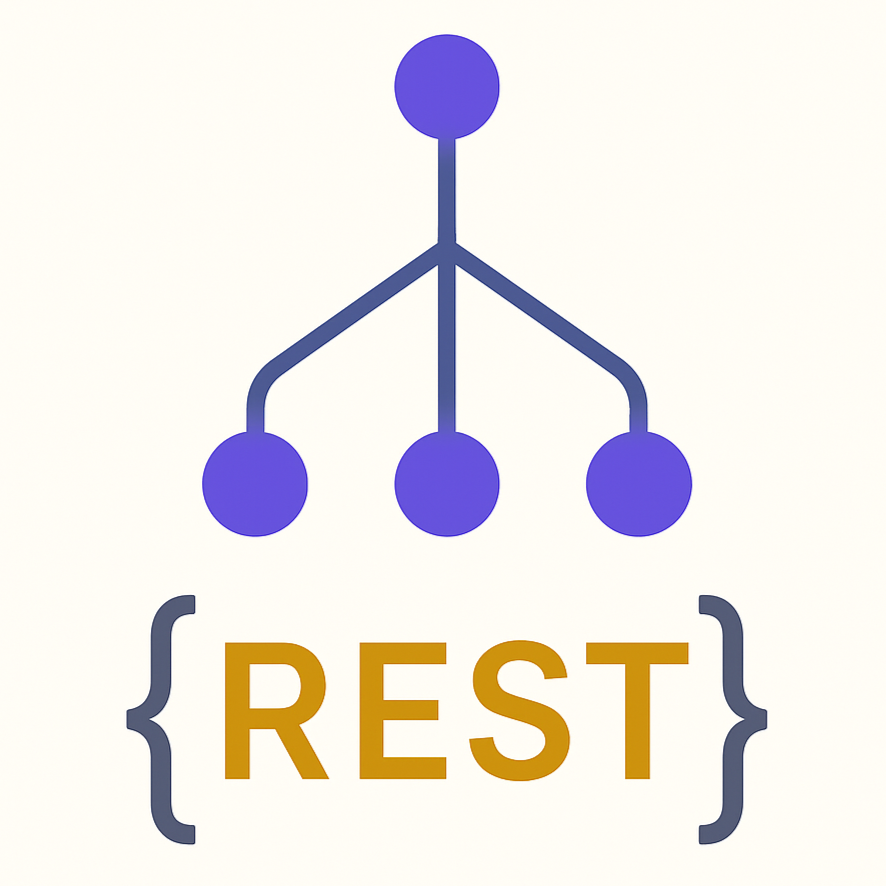

<div align="center">

# 🚀 Configurable Backend Engine (CBE)

### The Ultimate No/Low-Code Backend API Builder


[📚 Documentation](docs/index.md) • [🐛 Report Bug](https://github.com/07prajwal2000/Configurable-Backend-Engine/issues) • [💡 Request Feature](https://github.com/07prajwal2000/Configurable-Backend-Engine/discussions)

---

### ✨ **Build APIs Visually, Deploy Instantly**

Create complex backend APIs through an intuitive drag-and-drop interface. No coding required, but fully extensible for advanced use cases.

</div>


## 🚀 **Quick Start**

### **1. Installation**

```bash
# Clone the repository
git clone https://github.com/07prajwal2000/Configurable-Backend-Engine.git
cd Configurable-Backend-Engine

# Install dependencies
npm install

# Run the database using docker-compose
docker-compose up -d
```

### **2. Start Development Server**

```bash
# modify the .env.example and change it to .env

# Start all services using turborepo
npm run dev

# Or start individually
cd apps/server && npm run dev # Backend API server
cd apps/ui && npm run dev     # Frontend editor
```

### **3. Access the Application**

- **🎨 Visual Editor**: http://localhost:3000
- **📖 API Documentation**: http://localhost:3001/_/admin/openapi/ui
- **🔌 API Base URL**: http://localhost:3001/_/admin

### **4. Create Your First API**

1. **Open the Editor**: Navigate to http://localhost:3000
2. **Add Entrypoint Block**: Every API needs an entry point
3. **Add Processing Blocks**: Connect blocks to define your logic
4. **Add Response Block**: Generate the final API response
5. **Test Your API**: Test it by curl'ing to the url

---

## 📚 **Documentation**
Hosted with MkDocs [link here](https://07prajwal2000.github.io/Configurable-Backend-Engine/)

### **📖 Getting Started**
- [Installation Guide](docs/getting-started/installation.md)
- [Quick Start Tutorial](docs/index.md#quick-start)
- [Configuration Options](docs/getting-started/installation.md#detailed-configuration)

---

## 🤝 **Contributing**

We welcome contributions! Here's how you can help:

### **🐛 Bug Reports**
- Use [GitHub Issues](https://github.com/07prajwal2000/Configurable-Backend-Engine/issues) to report bugs
- Include detailed steps to reproduce
- Attach screenshots or error logs

### **💡 Feature Requests**
- Share your ideas in [GitHub Discussions](https://github.com/07prajwal2000/Configurable-Backend-Engine/discussions)
- Describe the problem you're trying to solve
- Include mockups or examples if possible

### **🔧 Code Contributions**
- Fork the repository
- Create a feature branch
- Make your changes
- Submit a pull request

### **📝 Documentation**
- Help improve documentation
- Translate to other languages
- Create tutorials and guides

---

## 📈 **Roadmap**

### **🚀 Phase 1 (Current)**
- ✅ Visual drag-and-drop editor
- ✅ Core block library
- ✅ REST API generation
- ✅ PostgreSQL integration
- ✅ TypeScript support

### **🔥 Phase 2 (Upcoming)**
- 🔐 **Secrets Management**: Secure loading and saving of secrets
- �️ **Database Interaction Blocks**: Native database operation blocks
- 🔑 **JWT Blocks**: JSON Web Token handling and validation
- ☁️ **Serverless Support**: Deploy to serverless functions
- ⏰ **Cron Support**: Scheduled task execution
- 🤖 **AI Integration**: AI-powered API generation
- � **Audit Logs**: Execution history and trails
- 👥 **Multi-user Authentication**: User management system
- 🔄 **Realtime Capabilities**: Live collaboration features
- � **Backups**: Automated data backup systems
- 🛒 **Marketplace**: Online hub for blocks built by community

---

## 📄 **License**

This project is licensed under the **MIT License** - see the [LICENSE](LICENSE) file for details.

---

## 🙏 **Acknowledgments**

- **Hono.js** for the amazing web framework
- **Drizzle Team** for the excellent ORM
- **React Flow** for the visual editor foundation
- **Open Source Community** for inspiration and support

---

### **💬 Community**
- [GitHub Discussions](https://github.com/07prajwal2000/Configurable-Backend-Engine/discussions)

### **🐛 Issue Tracking**
- [GitHub Issues](https://github.com/07prajwal2000/Configurable-Backend-Engine/issues)

---

<div align="center">

### **🎉 Ready to Build Amazing APIs?**

**[Get Started Now](docs/getting-started/installation.md)** • **[View Documentation](docs/index.md)** • **[Join Community](https://github.com/07prajwal2000/Configurable-Backend-Engine/discussions)**

---

**Made with ❤️ & 🤖 by [07prajwal2000](https://github.com/07prajwal2000)**

</div>
