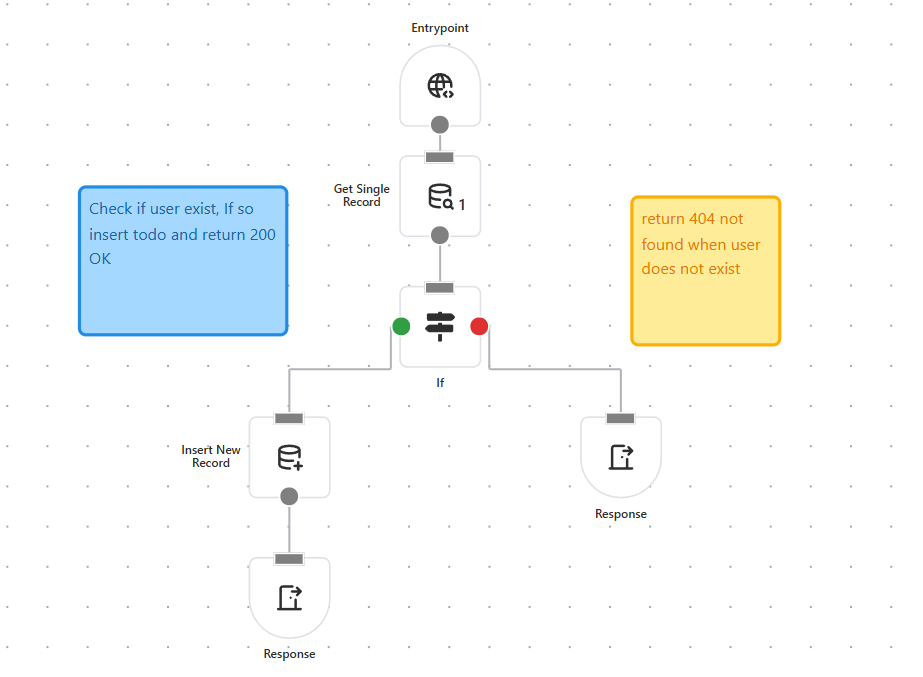

<div align="center">


### The Ultimate No/Low-Code Backend API Builder

---

### ✨ **Build APIs Visually, Deploy Instantly**



Create complex backend APIs through an intuitive drag-and-drop interface. No coding required, but fully extensible for advanced use cases.

</div>

## 🚀 **Quick Start**
1. Clone the repository
2. Install dependencies
    ```bash
    npm install
    ```
3. Run dependencies using docker-compose
    ```bash
    docker-compose up -d
    ```
4. Start the application
    ```bash
    npm run dev
    ```
5. Goto http://localhost:8000 to access the application running behind caddy server

---

## 📈 **Roadmap**

- ✅ Visual drag-and-drop editor
- ✅ Core block library
- ✅ REST API generation
- ✅ PostgreSQL integration
- ✅ TypeScript support
- ✅ Secrets Management: Secure loading and saving of secrets
- ✅ Database Interaction Blocks: Native database operation blocks
- [-] Configurable Integrations: Connect to any service with ease
  - [x] PostgreSQL
  - [ ] MySQL
  - [ ] MongoDB
  - [ ] Redis/Memcached
- 👥 **Multi-user Authentication**: User management system (WIP)
- 🔑 **JWT Blocks**: JSON Web Token handling and validation
- ☁️ **Serverless Support**: Deploy to serverless functions
- ⏰ **Cron Support**: Scheduled task execution
- 🤖 **AI Integration**: AI-powered API generation
- � **Audit Logs**: Execution history and trails
- 🔄 **Realtime Capabilities**: Live collaboration features
- � **Backups**: Automated data backup systems
- 🛒 **Marketplace**: Online hub for blocks built by community

---

## 📊 **Contributing**

Found a bug 🐛 or have a feature idea? Please open an issue or submit a pull request to an existing issue.

---

## 📄 **License**

This project is licensed under the **MIT License** - see the [LICENSE](LICENSE) file for details.
