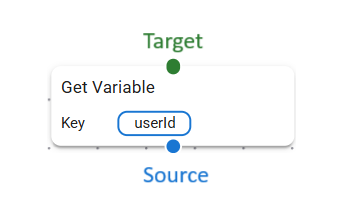

# Introduction to Blocks

Blocks are the building pieces for building configurable backend routes. They connect one-by-one just like a lego brick.

Each block has a Source (blue knob) and Target (green knob) Connection(s), and some nodes have other Connection(s) as well which has different purposes.

| Type | Color | Purpose |
|---|---|---|
| Source | Blue | Connects to next node and optionally passes the input |
| Target | Green | Accepts connection and input |

 

## Built-in Blocks

The below 2 are the important blocks for the request. 

-   **[Entrypoint](./entrypoint.md)**: Default block which exists only one in any request. It is the starting point of the request, which takes care of parsing request body, query/route params, and headers.
-   **[Response](./response.md)**: Block which returns the response to the http router.

There are several built-in blocks available. (Adding more every day)

-   **[If](built-in/if.md)**: Conditional If condition block.
-   **Loops**:
    -   **[For](built-in/for.md)**: Loop block which loops from start to end with step (incrementer).
    -   **[ForEach](built-in/foreach.md)**: Inherited by for loop, which accepts array as input or from params and loops through it.
-   **[JsRunner](built-in/jsrunner.md)**: Runs Javascript code in an isolated sandbox vm (uses '_node:vm_' package) with the current request's context.
-   **[Transformer](built-in/transformer.md)**: Transforms the js object to a new object with specified field map.
-   **[SetVar](built-in/setvar.md)**: Block which sets variable to the current request's context. It is accessible throughout the request.
-   **[Response](./response.md)**: Block which returns the response to the http router.
-   **Logging**
    -   **[Console](built-in/console.md)**: Logs output to CLI console. (not much useful for a server-based, but useful for development purposes).
-   **Debugging**
    -   **[Interceptor](built-in/interceptor.md)**: Used for development purposes to intercept the execution chain.
