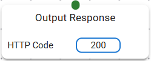

# Response/Output Block


This block is used to return the response to the router. Whatever data which is sent into the param block will be the body of that request. 

### Connections
| Type | Purpose |
|------|-------|
| Target | The body of the request must be passed from the previous block as an input to this block. |

In addition to the body, it is also possible to set any headers to the request. To set any headers to the request, it is required to set the `responseHttpHeaders` variable in the context. Below is an example to set a header, but this is being run inside a [JS Runner](./built-in/jsrunner.md) block.

```javascript
responseHttpHeaders["Content-Type"] = "application/json";
```

!!! note
    It is not required to initialize the `responseHttpHeaders` in vars, doing so will override the existing headers.
